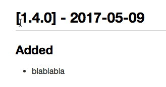

# chlu-cli

<a href="https://standardjs.com" style="float: right; padding: 0 0 20px 20px;"></a>

> CH-ange-L-og U-pdate - Automatically fix errors in your changelog file

[![Build Status][travis-img]][travis-url]
[![bitHound Score][bithound-img]][bithound-url]
[![bitHound Dependencies][deps-img]][deps-url]
[![bitHound Dev Dependencies][dev-img]][dev-url]
[![Downloads/Month][downloads-img]][downloads-url]

## Table of Contents

<!-- START doctoc generated TOC please keep comment here to allow auto update -->
<!-- DON'T EDIT THIS SECTION, INSTEAD RE-RUN doctoc TO UPDATE -->


- [Install](#install)
- [What it does](#what-it-does)
  - [1. Missing diff URLs in the footer for newly-added titles](#1-missing-diff-urls-in-the-footer-for-newly-added-titles)
  - [2. Wrong package/user in the diff URL](#2-wrong-packageuser-in-the-diff-url)
  - [3. Automatic title linking (where it's missing)](#3-automatic-title-linking-where-its-missing)
  - [4. Automatic date conversion](#4-automatic-date-conversion)
- [Extras](#extras)
- [A nifty setup idea](#a-nifty-setup-idea)
- [Contributing](#contributing)
- [Licence](#licence)

<!-- END doctoc generated TOC please keep comment here to allow auto update -->

## Install

```bash
$ npm i -g chlu-cli
```

Yes, install globally. This is a CLI app.

## What it does

`chlu` stands for CHangeLog Update. Your changelogs should follow the rules given by http://keepachangelog.com. However, errors happen and `chlu` automatically and silently fixes known common errors in changelogs. Let me go through the most common mistakes (from my experience):

### 1. Missing diff URLs in the footer for newly-added titles

This is the primary reason I created `chlu`. Often I clone the previous title and feature description but forget to clone and edit the **title's link in the footer**. `chlu` will scan all titles and add the missing links in the footer. Working on the changelog of this very repo:


Observe how I can delete footer links and they are restored by `chlu`! Magic!

In practice, this means your titles become actually linked (before/after example below):



### 2. Wrong package/user in the diff URL

This has happened to me before, actually on Detergent's repo even. I copied and edited the changelog from my other library and forgot to edit the package name in the footer diff links. For example, `PUT_A_WRONG_NAME_OF_THE_PACKAGE_HERE` below would get replaced by the correct name fresh from your `package.json`:

```md
[1.4.0]: https://github.com/codsen/PUT_A_WRONG_PACKAGE_HERE/compare/v1.3.0...v1.4.0
```

Same with wrong user names in the URL.

### 3. Automatic title linking (where it's missing)

I believe that every title in the changelog should be linked to a GitHub's magic diff view, showing what was added between those two versions.

Chlu will scan the titles and add GitHub magic diff links between each title. The smallest version's title won't get a link.

For example, if you have:

```md
## 3.1.2 (2017-03-17)

blablabla

## 3.1.1 (2017-03-01)

blablabla

## 3.1.0 (2017-02-27)

blablabla
```

If would add links on `3.1.2` (comparing it against `3.1.1`) and `3.1.1` (comparing it against `3.1.0`).

### 4. Automatic date conversion

As long as your titles follow reasonable patterns, `chlu` will recognise and convert the dates into a correct format. Also, it will add missing dash between the version and the date.

For example, all titles below would get converted to the same thing: `## [3.1.2] - 2017-03-17`:

```md
## 3.1.2 (2017-3-17)
## 3.1.2 (2017-03-17)
## 3.1.2 (March 17th, 2017)
## 3.1.2  (March 17th, 2017)
## 3.1.2 (March 17, 2017)
## 3.1.2 2017-3-17
## 3.1.2 2017-03-17
## 3.1.2 March 17th, 2017
## 3.1.2 March 17, 2017
## 3.1.2  March 17, 2017
## 3.1.2 - (2017-3-17)
## 3.1.2 - (2017-03-17)
## 3.1.2 - (March 17th, 2017)
## 3.1.2 -  (March 17th, 2017)
## 3.1.2 - (March 17, 2017)
## 3.1.2 - 2017-3-17
## 3.1.2 - 2017-03-17
## 3.1.2 - March 17th, 2017
## 3.1.2 - March 17, 2017
## 3.1.2 -  March 17, 2017
...and many other date combinations
```

That's thanks to amazing [dehumanize-date](https://www.npmjs.com/package/dehumanize-date).

## Extras

Since the order of the features is descending, the default order of title Markdown links in the footer should also be descending. That's also how example in http://keepachangelog.com is set. I dislike that. Personally, I find it difficult to visually `grep` the links if they are in descending order. That's why `chlu` will respect the **existing** order of your footer links and add the missing link **in order you've already got**. If all your title links are missing, the default order is sensible _descending_. In the meantime, I'll keep my footer links in an _ascending_ order.

## A nifty setup idea

It would be tedious and unnecessary to run `chlu` manually. Not to mention, you might even forget to run it.

What I suggest, add `chlu` to one of your aliases, for example, `git add .`. That's what I do.

For example, edit your `.zshrc` (or Bash config, or whatever-you-are-using-shell's config) file to contain:

```
# create a function which runs commands if certain files exist, and skips if they don't:
my-git-add() {
  [ -e readme.md ] && doctoc readme.md
  [ -e readme.md ] && bitsausage
  [ -e changelog.md ] && chlu changelog.md
  npm-check
  git add .
}

# create alias for your command, call the function:
alias gaa=my-git-add
```

The example above runs:

- [doctoc](https://www.npmjs.com/package/doctoc) on `readme.md` if it exists,
- then it runs [chlu](https://www.npmjs.com/package/chlu-cli) on `changelog.md` if it exists,
- then it runs [bitsausage](https://github.com/codsen/bitsausage) if it detects you use BitHound,
- then it runs [npm-check](https://www.npmjs.com/package/npm-check) and lastly,
- it runs the `git add .`.

It means, you always get your readme, changelog, BitHound config (`.bithoundrc`) committed in a correct, updated state. Also it will notify you if any of your dependencies are outdated or unused. Just install all the packages above globally, with  `-g` flag.

The example above is growing; I want to automate _everything_. Literally.

## Contributing

All contributions are welcome. Please stick to [Standard JavaScript](https://standardjs.com) notation.

If you see anything incorrect whatsoever, do [raise an issue](https://github.com/codsen/chlu-cli/issues). If you have any comments on the code, including ideas how to improve something, don't hesitate to contact me by email, Twitter or raise an issue on a mentioned issue link.

## Licence

> MIT License (MIT)

> Copyright (c) 2017 Codsen Ltd, Roy Revelt

> Permission is hereby granted, free of charge, to any person obtaining a copy
of this software and associated documentation files (the "Software"), to deal
in the Software without restriction, including without limitation the rights
to use, copy, modify, merge, publish, distribute, sublicense, and/or sell
copies of the Software, and to permit persons to whom the Software is
furnished to do so, subject to the following conditions:

> The above copyright notice and this permission notice shall be included in all
copies or substantial portions of the Software.

> THE SOFTWARE IS PROVIDED "AS IS", WITHOUT WARRANTY OF ANY KIND, EXPRESS OR
IMPLIED, INCLUDING BUT NOT LIMITED TO THE WARRANTIES OF MERCHANTABILITY,
FITNESS FOR A PARTICULAR PURPOSE AND NONINFRINGEMENT. IN NO EVENT SHALL THE
AUTHORS OR COPYRIGHT HOLDERS BE LIABLE FOR ANY CLAIM, DAMAGES OR OTHER
LIABILITY, WHETHER IN AN ACTION OF CONTRACT, TORT OR OTHERWISE, ARISING FROM,
OUT OF OR IN CONNECTION WITH THE SOFTWARE OR THE USE OR OTHER DEALINGS IN THE
SOFTWARE.

[travis-img]: https://travis-ci.org/codsen/chlu-cli.svg?branch=master
[travis-url]: https://travis-ci.org/codsen/chlu-cli

[bithound-img]: https://www.bithound.io/github/codsen/chlu-cli/badges/score.svg
[bithound-url]: https://www.bithound.io/github/codsen/chlu-cli

[deps-img]: https://www.bithound.io/github/codsen/chlu-cli/badges/dependencies.svg
[deps-url]: https://www.bithound.io/github/codsen/chlu-cli/master/dependencies/npm

[dev-img]: https://www.bithound.io/github/codsen/chlu-cli/badges/devDependencies.svg
[dev-url]: https://www.bithound.io/github/codsen/chlu-cli/master/dependencies/npm

[downloads-img]: https://img.shields.io/npm/dm/chlu-cli.svg
[downloads-url]: https://www.npmjs.com/package/chlu-cli
