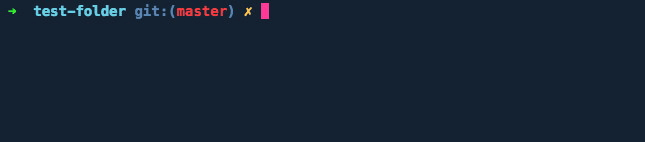

# Codsen

    A lerna monorepo for our 113 npm libraries 📦📦📦

The aim of Codsen is to help people.

Use these programs, profit from them, use them as ingredients to make even greater programs 🍻

## 💡 Table of Contents

- [Flagship Libraries](#-flagship-libraries)
- [Range Libraries](#-range-libraries)
- [HTML Processing Libraries](#-html-processing-libraries)
- [String Processing Libraries](#-string-processing-libraries)
- [Object Processing Libraries](#-object-processing-libraries)
- [Lerna Libraries](#-lerna-libraries)
- [CLI Apps](#%EF%B8%8F-cli-apps)
- [Miscellaneous Libraries](#%EF%B8%8F-miscellaneous-libraries)
- [Contributing](#-contributing)
- [Licence](#-licence)

**[⬆ back to top](#codsen)**

## 🚢 Flagship Libraries

| Library's name | Purpose | Web app | The&nbsp;link&nbsp;to&nbsp;npm | Source code in monorepo |
| -------------- | ------- | ------- | ----------- | ----------------------- |
| [`email-comb`](https://gitlab.com/codsen/codsen/tree/master/packages/email-comb/) | Remove unused CSS from email templates | [emailcomb.com](https://emailcomb.com) |  | [packages/email-comb](https://gitlab.com/codsen/codsen/tree/master/packages/email-comb/) |
| [`html-crush`](https://gitlab.com/codsen/codsen/tree/master/packages/html-crush/) | Minifies HTML/CSS: valid or broken, pure or mixed with other languages | [htmlcrush.com](https://htmlcrush.com) |  | [packages/html-crush](https://gitlab.com/codsen/codsen/tree/master/packages/html-crush/) |
| [`detergent`](https://gitlab.com/codsen/codsen/tree/master/packages/detergent/) | a tool to prepare text for pasting into HTML | [detergent.io](https://detergent.io) |  | [packages/detergent](https://gitlab.com/codsen/codsen/tree/master/packages/detergent/) |

Let's group all others by their purpose.

**[⬆ back to top](#codsen)**

## 🎯 Range Libraries

12 in total.

> _Range_ means an array of two text character index numbers, "from" and "to" (plus optional third element, string, which marks "what to add").

For example, "from the third character to the fourth character" could be marked with array `[3, 4]`.

There can be a **third element** in a range array, what to add instead of the range. For example, `[10, 12, "add this"]`. When there is no third element in the range array, like `[10, 12]`, that would mean "delete from index 10 to index 12". Empty third element is the same as if it was missing.

For example, a range `[1, 3]` in a string "`abcdef`" would mean `bc` because "b" is at index number 1 (counting starts at zero) and 3rd is "d". The beginning of the range is inclusive, and the ending is not. Hence, the result "bc".

Another example, if you want to replace "`{placeholder}`" with "John" in a string "`Hi {placeholder}!`"^, the range would be `[3, 16, "John"]`.

Now, if you have **many ranges**, you put them into an array. You get _an array of ranges_. Majority of `range-` libraries process such arrays of ranges: sort bunch of ranges, fix overlapping ranges and so on.

Practically, we need ranges when we process strings and want to "keep a note" of what needs to be deleted or replaced later. The idea is, instead of processing the string many times:

    "find out what needs to be done with a string" ->
    "mutate the string" ->
    "find out what more needs to be done with a string" ->
    "mutate the mutated string" ->
    ... and so on,

We only "compile a to-do list" — [push the ranges](https://gitlab.com/codsen/codsen/tree/master/packages/ranges-push/) into an array. When we finish gathering them, we **do all the actions in one go**.

Performing string processing only once is better for both **performance** reasons (fewer actions = faster) and for **consistency** (in-between taking the notes, we operate on the original string instead of its previously mutated version).

If you think, strings are immutable in JavaScript — each change of a string means rewriting it in a computer memory. Let's say you want to add a letter and delete the same letter in a string which consists of a thousand characters. Both actions cancel each other out. However, if you do the string edits sequentially, you write a thousand characters to memory two times, after every amend. On the other hand, if you use _ranges_ approach, you'd only [create a new record](https://gitlab.com/codsen/codsen/tree/master/packages/ranges-push/) in the computer memory, housing a couple of arrays, each consisting of couple index numbers. When you [process the ranges](https://gitlab.com/codsen/codsen/tree/master/packages/ranges-apply), they would cancel each other out, and we would not write anything to the memory at all. Now, if you scale this — longer strings, more amends, and done many times — you'll soon feel the difference in performance.

| Library's name | Purpose | The&nbsp;link&nbsp;to&nbsp;npm | Source code in monorepo |
| -------------- | ------- | ----------- | ----------------------- |
| [`ranges-push`](https://gitlab.com/codsen/codsen/tree/master/packages/ranges-push/) | Manage the array of ranges referencing the index ranges within the string |  | [packages/ranges-push](https://gitlab.com/codsen/codsen/tree/master/packages/ranges-push/) |
| [`ranges-apply`](https://gitlab.com/codsen/codsen/tree/master/packages/ranges-apply/) | Take an array of string slice ranges, delete/replace the string according to them |  | [packages/ranges-apply](https://gitlab.com/codsen/codsen/tree/master/packages/ranges-apply/) |
| [`ranges-merge`](https://gitlab.com/codsen/codsen/tree/master/packages/ranges-merge/) | Merge and sort arrays which mean string slice ranges |  | [packages/ranges-merge](https://gitlab.com/codsen/codsen/tree/master/packages/ranges-merge/) |
| [`ranges-sort`](https://gitlab.com/codsen/codsen/tree/master/packages/ranges-sort/) | Sort natural number index ranges [ [5, 6], [1, 3] ] => [ [1, 3], [5, 6] ] |  | [packages/ranges-sort](https://gitlab.com/codsen/codsen/tree/master/packages/ranges-sort/) |
| [`string-range-expander`](https://gitlab.com/codsen/codsen/tree/master/packages/string-range-expander/) | Expands string index ranges within whitespace boundaries until letters are met |  | [packages/string-range-expander](https://gitlab.com/codsen/codsen/tree/master/packages/string-range-expander/) |
| [`ranges-crop`](https://gitlab.com/codsen/codsen/tree/master/packages/ranges-crop/) | Crop array of ranges when they go beyond the reference string's length |  | [packages/ranges-crop](https://gitlab.com/codsen/codsen/tree/master/packages/ranges-crop/) |
| [`ranges-ent-decode`](https://gitlab.com/codsen/codsen/tree/master/packages/ranges-ent-decode/) | Decode HTML entities recursively, get string index ranges of what needs to be replaced where |  | [packages/ranges-ent-decode](https://gitlab.com/codsen/codsen/tree/master/packages/ranges-ent-decode/) |
| [`ranges-invert`](https://gitlab.com/codsen/codsen/tree/master/packages/ranges-invert/) | Invert string index ranges [ [1, 3] ] => [ [0, 1], [3, ...] ] |  | [packages/ranges-invert](https://gitlab.com/codsen/codsen/tree/master/packages/ranges-invert/) |
| [`ranges-is-index-within`](https://gitlab.com/codsen/codsen/tree/master/packages/ranges-is-index-within/) | Efficiently checks if index is within any of the given ranges |  | [packages/ranges-is-index-within](https://gitlab.com/codsen/codsen/tree/master/packages/ranges-is-index-within/) |
| [`ranges-iterate`](https://gitlab.com/codsen/codsen/tree/master/packages/ranges-iterate/) | Iterate a string and any changes within already existing ranges |  | [packages/ranges-iterate](https://gitlab.com/codsen/codsen/tree/master/packages/ranges-iterate/) |
| [`ranges-process-outside`](https://gitlab.com/codsen/codsen/tree/master/packages/ranges-process-outside/) | Iterate through string and optionally a given ranges as if they were one |  | [packages/ranges-process-outside](https://gitlab.com/codsen/codsen/tree/master/packages/ranges-process-outside/) |
| [`ranges-regex`](https://gitlab.com/codsen/codsen/tree/master/packages/ranges-regex/) | Perform a regex search on string and get a ranges array of findings (or null) |  | [packages/ranges-regex](https://gitlab.com/codsen/codsen/tree/master/packages/ranges-regex/) |

**[⬆ back to top](#codsen)**

## 💰 HTML Processing Libraries

13 in total.

They all process HTML and CSS. Except for `html-table-patcher`, all of them process HTML as a string, without parsing. Heck, we even had `html-table-patcher` done in non-parsing style on earlier versions but just because of time shortage went the parsing-way.

The whole idea is, if you don't parse the HTML, you can support broken or mixed code. Unless you write your parser, it becomes a bottleneck — parser throws here and there, and you can do nothing about it.

It is vital to support _broken code_ because this allows us to make broken code fixing programs.

It is equally vital to support _mixed code_ because both web page and email template HTML can contain anything from templating languages to programming languages. For example, Wordpress website has some HTML within PHP files. Another example, email templates are coded in Nunjucks templating language and `.nunjucks` files are HTML sprinkled with their templating literals. If tooling supports HTML mixed with _other things_, we will be able to process that HTML and skip those _other things_.

| Library's name | Purpose | The&nbsp;link&nbsp;to&nbsp;npm | Source code in monorepo |
| -------------- | ------- | ----------- | ----------------------- |
| [`emlint`](https://gitlab.com/codsen/codsen/tree/master/packages/emlint/) | Pluggable email template code linter |  | [packages/emlint](https://gitlab.com/codsen/codsen/tree/master/packages/emlint/) |
| [`string-strip-html`](https://gitlab.com/codsen/codsen/tree/master/packages/string-strip-html/) | Strips HTML tags from strings. No parser, accepts mixed sources. |  | [packages/string-strip-html](https://gitlab.com/codsen/codsen/tree/master/packages/string-strip-html/) |
| [`detect-is-it-html-or-xhtml`](https://gitlab.com/codsen/codsen/tree/master/packages/detect-is-it-html-or-xhtml/) | Answers, is the string input string more an HTML or XHTML (or neither) |  | [packages/detect-is-it-html-or-xhtml](https://gitlab.com/codsen/codsen/tree/master/packages/detect-is-it-html-or-xhtml/) |
| [`html-table-patcher`](https://gitlab.com/codsen/codsen/tree/master/packages/html-table-patcher/) | Wraps any content between TR/TD tags in additional rows/columns to appear in browser correctly |  | [packages/html-table-patcher](https://gitlab.com/codsen/codsen/tree/master/packages/html-table-patcher/) |
| [`is-html-tag-opening`](https://gitlab.com/codsen/codsen/tree/master/packages/is-html-tag-opening/) | Is given opening bracket a beginning of a tag? |  | [packages/is-html-tag-opening](https://gitlab.com/codsen/codsen/tree/master/packages/is-html-tag-opening/) |
| [`is-html-attribute-closing`](https://gitlab.com/codsen/codsen/tree/master/packages/is-html-attribute-closing/) | Is a character on a given index a closing of an HTML attribute? |  | [packages/is-html-attribute-closing](https://gitlab.com/codsen/codsen/tree/master/packages/is-html-attribute-closing/) |
| [`is-language-code`](https://gitlab.com/codsen/codsen/tree/master/packages/is-language-code/) | Is given string a language code (as per IANA) |  | [packages/is-language-code](https://gitlab.com/codsen/codsen/tree/master/packages/is-language-code/) |
| [`html-img-alt`](https://gitlab.com/codsen/codsen/tree/master/packages/html-img-alt/) | Adds missing ALT attributes to IMG tags and cleans within IMG tags. No HTML parsing used. |  | [packages/html-img-alt](https://gitlab.com/codsen/codsen/tree/master/packages/html-img-alt/) |
| [`is-media-descriptor`](https://gitlab.com/codsen/codsen/tree/master/packages/is-media-descriptor/) | Is given string a valid media descriptor (including media query)? |  | [packages/is-media-descriptor](https://gitlab.com/codsen/codsen/tree/master/packages/is-media-descriptor/) |
| [`is-relative-uri`](https://gitlab.com/codsen/codsen/tree/master/packages/is-relative-uri/) | Is given string a relative URI? |  | [packages/is-relative-uri](https://gitlab.com/codsen/codsen/tree/master/packages/is-relative-uri/) |
| [`is-char-suitable-for-html-attr-name`](https://gitlab.com/codsen/codsen/tree/master/packages/is-char-suitable-for-html-attr-name/) | Is given character suitable to be in an HTML attribute's name? |  | [packages/is-char-suitable-for-html-attr-name](https://gitlab.com/codsen/codsen/tree/master/packages/is-char-suitable-for-html-attr-name/) |
| [`html-entities-not-email-friendly`](https://gitlab.com/codsen/codsen/tree/master/packages/html-entities-not-email-friendly/) | All HTML entities which are not email template friendly |  | [packages/html-entities-not-email-friendly](https://gitlab.com/codsen/codsen/tree/master/packages/html-entities-not-email-friendly/) |
| [`html-all-known-attributes`](https://gitlab.com/codsen/codsen/tree/master/packages/html-all-known-attributes/) | All HTML attributes known to the Humanity |  | [packages/html-all-known-attributes](https://gitlab.com/codsen/codsen/tree/master/packages/html-all-known-attributes/) |

**[⬆ back to top](#codsen)**

## 🎻 String Processing Libraries

29 in total.

They process string inputs, which might be text, code or something else as long as it is of a string type.

| Library's name | Purpose | The&nbsp;link&nbsp;to&nbsp;npm | Source code in monorepo |
| -------------- | ------- | ----------- | ----------------------- |
| [`edit-package-json`](https://gitlab.com/codsen/codsen/tree/master/packages/edit-package-json/) | Edit package.json without parsing, as string, keep indentation etc intact |  | [packages/edit-package-json](https://gitlab.com/codsen/codsen/tree/master/packages/edit-package-json/) |
| [`easy-replace`](https://gitlab.com/codsen/codsen/tree/master/packages/easy-replace/) | Replace strings with optional lookarounds, but without regexes |  | [packages/easy-replace](https://gitlab.com/codsen/codsen/tree/master/packages/easy-replace/) |
| [`str-indexes-of-plus`](https://gitlab.com/codsen/codsen/tree/master/packages/str-indexes-of-plus/) | Search for a string in another string. Get array of indexes. Full Unicode support. |  | [packages/str-indexes-of-plus](https://gitlab.com/codsen/codsen/tree/master/packages/str-indexes-of-plus/) |
| [`bitbucket-slug`](https://gitlab.com/codsen/codsen/tree/master/packages/bitbucket-slug/) | Generate BitBucket readme header anchor slug URLs. Unofficial, covers whole ASCII and a bit beyond. |  | [packages/bitbucket-slug](https://gitlab.com/codsen/codsen/tree/master/packages/bitbucket-slug/) |
| [`email-all-chars-within-ascii`](https://gitlab.com/codsen/codsen/tree/master/packages/email-all-chars-within-ascii/) | Scans all characters within a string and checks are they within ASCII range |  | [packages/email-all-chars-within-ascii](https://gitlab.com/codsen/codsen/tree/master/packages/email-all-chars-within-ascii/) |
| [`js-row-num`](https://gitlab.com/codsen/codsen/tree/master/packages/js-row-num/) | Update all row numbers in all console.logs in JS code |  | [packages/js-row-num](https://gitlab.com/codsen/codsen/tree/master/packages/js-row-num/) |
| [`csv-sort`](https://gitlab.com/codsen/codsen/tree/master/packages/csv-sort/) | Sorts double-entry bookkeeping CSV coming from internet banking |  | [packages/csv-sort](https://gitlab.com/codsen/codsen/tree/master/packages/csv-sort/) |
| [`csv-sort-cli`](https://gitlab.com/codsen/codsen/tree/master/packages/csv-sort-cli/) | Command line app to sort double-entry CSVs coming from internet banking statements |  | [packages/csv-sort-cli](https://gitlab.com/codsen/codsen/tree/master/packages/csv-sort-cli/) |
| [`csv-split-easy`](https://gitlab.com/codsen/codsen/tree/master/packages/csv-split-easy/) | Splits the CSV string into array of arrays, each representing a row of columns |  | [packages/csv-split-easy](https://gitlab.com/codsen/codsen/tree/master/packages/csv-split-easy/) |
| [`string-apostrophes`](https://gitlab.com/codsen/codsen/tree/master/packages/string-apostrophes/) | Comprehensive, HTML-entities-aware tool to typographically-correct the apostrophes and single/double quotes |  | [packages/string-apostrophes](https://gitlab.com/codsen/codsen/tree/master/packages/string-apostrophes/) |
| [`string-character-is-astral-surrogate`](https://gitlab.com/codsen/codsen/tree/master/packages/string-character-is-astral-surrogate/) | Tells, is given character a part of astral character, specifically, a high and low surrogate |  | [packages/string-character-is-astral-surrogate](https://gitlab.com/codsen/codsen/tree/master/packages/string-character-is-astral-surrogate/) |
| [`string-collapse-leading-whitespace`](https://gitlab.com/codsen/codsen/tree/master/packages/string-collapse-leading-whitespace/) | Collapse the leading and trailing whitespace of a string |  | [packages/string-collapse-leading-whitespace](https://gitlab.com/codsen/codsen/tree/master/packages/string-collapse-leading-whitespace/) |
| [`string-collapse-white-space`](https://gitlab.com/codsen/codsen/tree/master/packages/string-collapse-white-space/) | Efficient collapsing of white space with optional outer- and/or line-trimming and HTML tag recognition |  | [packages/string-collapse-white-space](https://gitlab.com/codsen/codsen/tree/master/packages/string-collapse-white-space/) |
| [`string-convert-indexes`](https://gitlab.com/codsen/codsen/tree/master/packages/string-convert-indexes/) | Convert string character indexes from JS native index-based to Unicode character-count-based and backwards. |  | [packages/string-convert-indexes](https://gitlab.com/codsen/codsen/tree/master/packages/string-convert-indexes/) |
| [`string-extract-class-names`](https://gitlab.com/codsen/codsen/tree/master/packages/string-extract-class-names/) | Extract class (or id) name from a string |  | [packages/string-extract-class-names](https://gitlab.com/codsen/codsen/tree/master/packages/string-extract-class-names/) |
| [`string-find-heads-tails`](https://gitlab.com/codsen/codsen/tree/master/packages/string-find-heads-tails/) | Search for string pairs. A special case of string search algorithm. |  | [packages/string-find-heads-tails](https://gitlab.com/codsen/codsen/tree/master/packages/string-find-heads-tails/) |
| [`string-find-malformed`](https://gitlab.com/codsen/codsen/tree/master/packages/string-find-malformed/) | Search for a malformed string. Think of Levenshtein distance but in search. |  | [packages/string-find-malformed](https://gitlab.com/codsen/codsen/tree/master/packages/string-find-malformed/) |
| [`string-fix-broken-named-entities`](https://gitlab.com/codsen/codsen/tree/master/packages/string-fix-broken-named-entities/) | Finds and fixes common and not so common broken named HTML entities, returns ranges array of fixes |  | [packages/string-fix-broken-named-entities](https://gitlab.com/codsen/codsen/tree/master/packages/string-fix-broken-named-entities/) |
| [`string-left-right`](https://gitlab.com/codsen/codsen/tree/master/packages/string-left-right/) | Look what's to the left or the right of a given index within a string |  | [packages/string-left-right](https://gitlab.com/codsen/codsen/tree/master/packages/string-left-right/) |
| [`string-match-left-right`](https://gitlab.com/codsen/codsen/tree/master/packages/string-match-left-right/) | Do substrings match what's on the left or right of a given index? |  | [packages/string-match-left-right](https://gitlab.com/codsen/codsen/tree/master/packages/string-match-left-right/) |
| [`string-overlap-one-on-another`](https://gitlab.com/codsen/codsen/tree/master/packages/string-overlap-one-on-another/) | Lay one string on top of another, with an optional offset |  | [packages/string-overlap-one-on-another](https://gitlab.com/codsen/codsen/tree/master/packages/string-overlap-one-on-another/) |
| [`string-process-comma-separated`](https://gitlab.com/codsen/codsen/tree/master/packages/string-process-comma-separated/) | Extracts chunks from possibly comma or whatever-separated string |  | [packages/string-process-comma-separated](https://gitlab.com/codsen/codsen/tree/master/packages/string-process-comma-separated/) |
| [`string-remove-duplicate-heads-tails`](https://gitlab.com/codsen/codsen/tree/master/packages/string-remove-duplicate-heads-tails/) | Detect and (recursively) remove head and tail wrappings around the input string |  | [packages/string-remove-duplicate-heads-tails](https://gitlab.com/codsen/codsen/tree/master/packages/string-remove-duplicate-heads-tails/) |
| [`string-remove-thousand-separators`](https://gitlab.com/codsen/codsen/tree/master/packages/string-remove-thousand-separators/) | Detects and removes thousand separators (dot/comma/quote/space) from string-type digits |  | [packages/string-remove-thousand-separators](https://gitlab.com/codsen/codsen/tree/master/packages/string-remove-thousand-separators/) |
| [`string-remove-widows`](https://gitlab.com/codsen/codsen/tree/master/packages/string-remove-widows/) | Helps to prevent widow words in a text |  | [packages/string-remove-widows](https://gitlab.com/codsen/codsen/tree/master/packages/string-remove-widows/) |
| [`string-split-by-whitespace`](https://gitlab.com/codsen/codsen/tree/master/packages/string-split-by-whitespace/) | Split string into array by chunks of whitespace |  | [packages/string-split-by-whitespace](https://gitlab.com/codsen/codsen/tree/master/packages/string-split-by-whitespace/) |
| [`string-trim-spaces-only`](https://gitlab.com/codsen/codsen/tree/master/packages/string-trim-spaces-only/) | Like `String.trim()` but you can choose granularly what to trim |  | [packages/string-trim-spaces-only](https://gitlab.com/codsen/codsen/tree/master/packages/string-trim-spaces-only/) |
| [`string-uglify`](https://gitlab.com/codsen/codsen/tree/master/packages/string-uglify/) | Uglify — generate unique short names for sets of strings |  | [packages/string-uglify](https://gitlab.com/codsen/codsen/tree/master/packages/string-uglify/) |
| [`string-unfancy`](https://gitlab.com/codsen/codsen/tree/master/packages/string-unfancy/) | Replace all fancy dashes, quotes etc with their simpler equivalents |  | [packages/string-unfancy](https://gitlab.com/codsen/codsen/tree/master/packages/string-unfancy/) |

**[⬆ back to top](#codsen)**

## 🔮 Object Processing Libraries

23 in total.

When we say "object" we mean _a plain object_ in JavaScript, for example, `{ name: "Bob" }`. Usually, plain objects come from JSON files, and often they are deeply nested. The following libraries help us to traverse them, set and delete keys and compare objects.

"`ast-`" in the library's name below just emphasises that it really works on nested objects (so-called Abstract Syntax Trees that come from parsed things).

| Library's name | Purpose | The&nbsp;link&nbsp;to&nbsp;npm | Source code in monorepo |
| -------------- | ------- | ----------- | ----------------------- |
| [`ast-monkey`](https://gitlab.com/codsen/codsen/tree/master/packages/ast-monkey/) | Traverse and edit AST's (like parsed HTML or anything nested) |  | [packages/ast-monkey](https://gitlab.com/codsen/codsen/tree/master/packages/ast-monkey/) |
| [`ast-monkey-traverse`](https://gitlab.com/codsen/codsen/tree/master/packages/ast-monkey-traverse/) | Utility library to traverse parsed HTML (AST's) or anything nested (plain objects within arrays within plain objects) |  | [packages/ast-monkey-traverse](https://gitlab.com/codsen/codsen/tree/master/packages/ast-monkey-traverse/) |
| [`ast-monkey-util`](https://gitlab.com/codsen/codsen/tree/master/packages/ast-monkey-util/) | Utility library of AST helper functions |  | [packages/ast-monkey-util](https://gitlab.com/codsen/codsen/tree/master/packages/ast-monkey-util/) |
| [`json-comb-core`](https://gitlab.com/codsen/codsen/tree/master/packages/json-comb-core/) | The inner core of json-comb |  | [packages/json-comb-core](https://gitlab.com/codsen/codsen/tree/master/packages/json-comb-core/) |
| [`json-variables`](https://gitlab.com/codsen/codsen/tree/master/packages/json-variables/) | It's like SASS variables, but for JSON |  | [packages/json-variables](https://gitlab.com/codsen/codsen/tree/master/packages/json-variables/) |
| [`object-merge-advanced`](https://gitlab.com/codsen/codsen/tree/master/packages/object-merge-advanced/) | Recursive, deep merge of anything (objects, arrays, strings or nested thereof), which weighs contents by type hierarchy to ensure the maximum content is retained |  | [packages/object-merge-advanced](https://gitlab.com/codsen/codsen/tree/master/packages/object-merge-advanced/) |
| [`ast-compare`](https://gitlab.com/codsen/codsen/tree/master/packages/ast-compare/) | Compare anything: AST, objects, arrays, strings and nested thereof |  | [packages/ast-compare](https://gitlab.com/codsen/codsen/tree/master/packages/ast-compare/) |
| [`ast-contains-only-empty-space`](https://gitlab.com/codsen/codsen/tree/master/packages/ast-contains-only-empty-space/) | Returns Boolean depending if passed AST contain only empty space |  | [packages/ast-contains-only-empty-space](https://gitlab.com/codsen/codsen/tree/master/packages/ast-contains-only-empty-space/) |
| [`ast-deep-contains`](https://gitlab.com/codsen/codsen/tree/master/packages/ast-deep-contains/) | an alternative assertion for Ava's t.deepEqual and Tap's t.same |  | [packages/ast-deep-contains](https://gitlab.com/codsen/codsen/tree/master/packages/ast-deep-contains/) |
| [`ast-delete-object`](https://gitlab.com/codsen/codsen/tree/master/packages/ast-delete-object/) | Delete all plain objects that contain a certain key/value pair |  | [packages/ast-delete-object](https://gitlab.com/codsen/codsen/tree/master/packages/ast-delete-object/) |
| [`ast-get-object`](https://gitlab.com/codsen/codsen/tree/master/packages/ast-get-object/) | Getter/setter for nested parsed HTML AST's, querying objects by key/value pairs |  | [packages/ast-get-object](https://gitlab.com/codsen/codsen/tree/master/packages/ast-get-object/) |
| [`ast-get-values-by-key`](https://gitlab.com/codsen/codsen/tree/master/packages/ast-get-values-by-key/) | Read or edit parsed HTML (or AST in general) |  | [packages/ast-get-values-by-key](https://gitlab.com/codsen/codsen/tree/master/packages/ast-get-values-by-key/) |
| [`ast-is-empty`](https://gitlab.com/codsen/codsen/tree/master/packages/ast-is-empty/) | Find out, is nested array/object/string/AST tree is empty |  | [packages/ast-is-empty](https://gitlab.com/codsen/codsen/tree/master/packages/ast-is-empty/) |
| [`ast-loose-compare`](https://gitlab.com/codsen/codsen/tree/master/packages/ast-loose-compare/) | Compare anything: AST, objects, arrays and strings |  | [packages/ast-loose-compare](https://gitlab.com/codsen/codsen/tree/master/packages/ast-loose-compare/) |
| [`ast-monkey-traverse-with-lookahead`](https://gitlab.com/codsen/codsen/tree/master/packages/ast-monkey-traverse-with-lookahead/) | Utility library to traverse parsed HTML (AST's) or anything nested (plain objects within arrays within plain objects) |  | [packages/ast-monkey-traverse-with-lookahead](https://gitlab.com/codsen/codsen/tree/master/packages/ast-monkey-traverse-with-lookahead/) |
| [`object-all-values-equal-to`](https://gitlab.com/codsen/codsen/tree/master/packages/object-all-values-equal-to/) | Does the AST/nested-plain-object/array/whatever contain only one kind of value? |  | [packages/object-all-values-equal-to](https://gitlab.com/codsen/codsen/tree/master/packages/object-all-values-equal-to/) |
| [`object-boolean-combinations`](https://gitlab.com/codsen/codsen/tree/master/packages/object-boolean-combinations/) | Generate an array full of object copies, each containing a unique Boolean value combination. Includes overrides. |  | [packages/object-boolean-combinations](https://gitlab.com/codsen/codsen/tree/master/packages/object-boolean-combinations/) |
| [`object-delete-key`](https://gitlab.com/codsen/codsen/tree/master/packages/object-delete-key/) | Delete keys from all arrays or plain objects, nested within anything, by key or by value or by both, and clean up afterwards. Accepts wildcards. |  | [packages/object-delete-key](https://gitlab.com/codsen/codsen/tree/master/packages/object-delete-key/) |
| [`object-fill-missing-keys`](https://gitlab.com/codsen/codsen/tree/master/packages/object-fill-missing-keys/) | Add missing keys into plain objects, according to a reference object |  | [packages/object-fill-missing-keys](https://gitlab.com/codsen/codsen/tree/master/packages/object-fill-missing-keys/) |
| [`object-flatten-all-arrays`](https://gitlab.com/codsen/codsen/tree/master/packages/object-flatten-all-arrays/) | Merge and flatten any arrays found in all values within plain objects |  | [packages/object-flatten-all-arrays](https://gitlab.com/codsen/codsen/tree/master/packages/object-flatten-all-arrays/) |
| [`object-flatten-referencing`](https://gitlab.com/codsen/codsen/tree/master/packages/object-flatten-referencing/) | Flatten complex nested objects according to a reference objects |  | [packages/object-flatten-referencing](https://gitlab.com/codsen/codsen/tree/master/packages/object-flatten-referencing/) |
| [`object-no-new-keys`](https://gitlab.com/codsen/codsen/tree/master/packages/object-no-new-keys/) | Check, does a plain object (AST/JSON) has any unique keys, not present in a reference object (another AST/JSON) |  | [packages/object-no-new-keys](https://gitlab.com/codsen/codsen/tree/master/packages/object-no-new-keys/) |
| [`object-set-all-values-to`](https://gitlab.com/codsen/codsen/tree/master/packages/object-set-all-values-to/) | Recursively walk the input and set all found values in plain objects to something |  | [packages/object-set-all-values-to](https://gitlab.com/codsen/codsen/tree/master/packages/object-set-all-values-to/) |

**[⬆ back to top](#codsen)**

## 🐉 Lerna Libraries

3 in total.

While maintaining this very monorepo we found that some essential tools were missing, so we created them!

If you also use Lerna monorepos, check these out:

| Library's name | Purpose | The&nbsp;link&nbsp;to&nbsp;npm | Source code in monorepo |
| -------------- | ------- | ----------- | ----------------------- |
| [`lerna-clean-changelogs-cli`](https://gitlab.com/codsen/codsen/tree/master/packages/lerna-clean-changelogs-cli/) | CLI application to cleanse the lerna-generated changelogs |  | [packages/lerna-clean-changelogs-cli](https://gitlab.com/codsen/codsen/tree/master/packages/lerna-clean-changelogs-cli/) |
| [`lerna-link-dep`](https://gitlab.com/codsen/codsen/tree/master/packages/lerna-link-dep/) | CLI to symlink a local package to the current package in Lerna monorepo |  | [packages/lerna-link-dep](https://gitlab.com/codsen/codsen/tree/master/packages/lerna-link-dep/) |
| [`update-versions`](https://gitlab.com/codsen/codsen/tree/master/packages/update-versions/) | Like npm-check-updates but supports Lerna monorepos and enforces strict semver values |  | [packages/update-versions](https://gitlab.com/codsen/codsen/tree/master/packages/update-versions/) |

**[⬆ back to top](#codsen)**

## ✂️ CLI Apps

11 in total.

All the following libraries are command line applications. You install them using `-g` flag, for example, `npm i -g json-sort-cli`.

You use them in the Terminal (command line), for example:

| Library's name | Purpose | The&nbsp;link&nbsp;to&nbsp;npm | Source code in monorepo |
| -------------- | ------- | ----------- | ----------------------- |
| [`json-comb`](https://gitlab.com/codsen/codsen/tree/master/packages/json-comb/) | Command line app to manage sets of JSON files |  | [packages/json-comb](https://gitlab.com/codsen/codsen/tree/master/packages/json-comb/) |
| [`update-versions`](https://gitlab.com/codsen/codsen/tree/master/packages/update-versions/) | Like npm-check-updates but supports Lerna monorepos and enforces strict semver values |  | [packages/update-versions](https://gitlab.com/codsen/codsen/tree/master/packages/update-versions/) |
| [`lerna-clean-changelogs-cli`](https://gitlab.com/codsen/codsen/tree/master/packages/lerna-clean-changelogs-cli/) | CLI application to cleanse the lerna-generated changelogs |  | [packages/lerna-clean-changelogs-cli](https://gitlab.com/codsen/codsen/tree/master/packages/lerna-clean-changelogs-cli/) |
| [`lerna-link-dep`](https://gitlab.com/codsen/codsen/tree/master/packages/lerna-link-dep/) | CLI to symlink a local package to the current package in Lerna monorepo |  | [packages/lerna-link-dep](https://gitlab.com/codsen/codsen/tree/master/packages/lerna-link-dep/) |
| [`lect`](https://gitlab.com/codsen/codsen/tree/master/packages/lect/) | Maintenance CLI for internal consumption |  | [packages/lect](https://gitlab.com/codsen/codsen/tree/master/packages/lect/) |
| [`chlu-cli`](https://gitlab.com/codsen/codsen/tree/master/packages/chlu-cli/) | CH-ange-L-og U-pdate — Automatically fix errors in your changelog file |  | [packages/chlu-cli](https://gitlab.com/codsen/codsen/tree/master/packages/chlu-cli/) |
| [`csv-sort-cli`](https://gitlab.com/codsen/codsen/tree/master/packages/csv-sort-cli/) | Command line app to sort double-entry CSVs coming from internet banking statements |  | [packages/csv-sort-cli](https://gitlab.com/codsen/codsen/tree/master/packages/csv-sort-cli/) |
| [`email-all-chars-within-ascii-cli`](https://gitlab.com/codsen/codsen/tree/master/packages/email-all-chars-within-ascii-cli/) | Command line app to scan email templates, are all their characters within ASCII range |  | [packages/email-all-chars-within-ascii-cli](https://gitlab.com/codsen/codsen/tree/master/packages/email-all-chars-within-ascii-cli/) |
| [`generate-atomic-css-cli`](https://gitlab.com/codsen/codsen/tree/master/packages/generate-atomic-css-cli/) | Generates and updates all HTML templates' atomic CSS |  | [packages/generate-atomic-css-cli](https://gitlab.com/codsen/codsen/tree/master/packages/generate-atomic-css-cli/) |
| [`js-row-num-cli`](https://gitlab.com/codsen/codsen/tree/master/packages/js-row-num-cli/) | Update all row numbers in all console.logs in JS code |  | [packages/js-row-num-cli](https://gitlab.com/codsen/codsen/tree/master/packages/js-row-num-cli/) |
| [`json-sort-cli`](https://gitlab.com/codsen/codsen/tree/master/packages/json-sort-cli/) | Command line app to deep sort JSON files, retains package.json special key order |  | [packages/json-sort-cli](https://gitlab.com/codsen/codsen/tree/master/packages/json-sort-cli/) |

**[⬆ back to top](#codsen)**

## 🛠️ Miscellaneous Libraries

36 in total.

| Library's name | Purpose | The&nbsp;link&nbsp;to&nbsp;npm | Source code in monorepo |
| -------------- | ------- | ----------- | ----------------------- |
| [`all-named-html-entities`](https://gitlab.com/codsen/codsen/tree/master/packages/all-named-html-entities/) | List of all named HTML entities |  | [packages/all-named-html-entities](https://gitlab.com/codsen/codsen/tree/master/packages/all-named-html-entities/) |
| [`array-group-str-omit-num-char`](https://gitlab.com/codsen/codsen/tree/master/packages/array-group-str-omit-num-char/) | Groups array of strings by omitting number characters |  | [packages/array-group-str-omit-num-char](https://gitlab.com/codsen/codsen/tree/master/packages/array-group-str-omit-num-char/) |
| [`array-includes-with-glob`](https://gitlab.com/codsen/codsen/tree/master/packages/array-includes-with-glob/) | like `_.includes` but with wildcards |  | [packages/array-includes-with-glob](https://gitlab.com/codsen/codsen/tree/master/packages/array-includes-with-glob/) |
| [`array-of-arrays-into-ast`](https://gitlab.com/codsen/codsen/tree/master/packages/array-of-arrays-into-ast/) | turns an array of arrays of data into a nested tree of plain objects |  | [packages/array-of-arrays-into-ast](https://gitlab.com/codsen/codsen/tree/master/packages/array-of-arrays-into-ast/) |
| [`array-of-arrays-sort-by-col`](https://gitlab.com/codsen/codsen/tree/master/packages/array-of-arrays-sort-by-col/) | sort array of arrays by column, rippling the sorting outwards from that column |  | [packages/array-of-arrays-sort-by-col](https://gitlab.com/codsen/codsen/tree/master/packages/array-of-arrays-sort-by-col/) |
| [`array-pull-all-with-glob`](https://gitlab.com/codsen/codsen/tree/master/packages/array-pull-all-with-glob/) | pullAllWithGlob — like `_.pullAll` but pulling stronger, with globs |  | [packages/array-pull-all-with-glob](https://gitlab.com/codsen/codsen/tree/master/packages/array-pull-all-with-glob/) |
| [`arrayiffy-if-string`](https://gitlab.com/codsen/codsen/tree/master/packages/arrayiffy-if-string/) | Put non-empty strings into arrays, turn empty-ones into empty arrays. Bypass everything else. |  | [packages/arrayiffy-if-string](https://gitlab.com/codsen/codsen/tree/master/packages/arrayiffy-if-string/) |
| [`charcode-is-valid-xml-name-character`](https://gitlab.com/codsen/codsen/tree/master/packages/charcode-is-valid-xml-name-character/) | Does a given character belong to XML spec's "Production 4 OR 4a" type (is acceptable for XML element's name) |  | [packages/charcode-is-valid-xml-name-character](https://gitlab.com/codsen/codsen/tree/master/packages/charcode-is-valid-xml-name-character/) |
| [`check-types-mini`](https://gitlab.com/codsen/codsen/tree/master/packages/check-types-mini/) | Check the types of your options object's values after user has customised them |  | [packages/check-types-mini](https://gitlab.com/codsen/codsen/tree/master/packages/check-types-mini/) |
| [`chlu`](https://gitlab.com/codsen/codsen/tree/master/packages/chlu/) | CH-ange-L-og U-pdate — Automatically fix errors in your changelog file |  | [packages/chlu](https://gitlab.com/codsen/codsen/tree/master/packages/chlu/) |
| [`codsen-parser`](https://gitlab.com/codsen/codsen/tree/master/packages/codsen-parser/) | Parser aiming at broken code, especially HTML & CSS |  | [packages/codsen-parser](https://gitlab.com/codsen/codsen/tree/master/packages/codsen-parser/) |
| [`codsen-tokenizer`](https://gitlab.com/codsen/codsen/tree/master/packages/codsen-tokenizer/) | HTML and CSS lexer aimed at code with fatal errors, accepts mixed coding languages |  | [packages/codsen-tokenizer](https://gitlab.com/codsen/codsen/tree/master/packages/codsen-tokenizer/) |
| [`color-shorthand-hex-to-six-digit`](https://gitlab.com/codsen/codsen/tree/master/packages/color-shorthand-hex-to-six-digit/) | Convert shorthand hex color codes into full |  | [packages/color-shorthand-hex-to-six-digit](https://gitlab.com/codsen/codsen/tree/master/packages/color-shorthand-hex-to-six-digit/) |
| [`detect-is-it-html-or-xhtml`](https://gitlab.com/codsen/codsen/tree/master/packages/detect-is-it-html-or-xhtml/) | Answers, is the string input string more an HTML or XHTML (or neither) |  | [packages/detect-is-it-html-or-xhtml](https://gitlab.com/codsen/codsen/tree/master/packages/detect-is-it-html-or-xhtml/) |
| [`email-homey`](https://gitlab.com/codsen/codsen/tree/master/packages/email-homey/) | Generate homepage in the Browsersync root with links/screenshots to all your email templates |  | [packages/email-homey](https://gitlab.com/codsen/codsen/tree/master/packages/email-homey/) |
| [`emlint`](https://gitlab.com/codsen/codsen/tree/master/packages/emlint/) | Pluggable email template code linter |  | [packages/emlint](https://gitlab.com/codsen/codsen/tree/master/packages/emlint/) |
| [`eslint-plugin-row-num`](https://gitlab.com/codsen/codsen/tree/master/packages/eslint-plugin-row-num/) | ESLint rule to update row numbers on each console.log |  | [packages/eslint-plugin-row-num](https://gitlab.com/codsen/codsen/tree/master/packages/eslint-plugin-row-num/) |
| [`generate-atomic-css`](https://gitlab.com/codsen/codsen/tree/master/packages/generate-atomic-css/) | Generate Atomic CSS |  | [packages/generate-atomic-css](https://gitlab.com/codsen/codsen/tree/master/packages/generate-atomic-css/) |
| [`gulp-email-remove-unused-css`](https://gitlab.com/codsen/codsen/tree/master/packages/gulp-email-remove-unused-css/) | Gulp plugin to remove unused CSS classes/id's from styles in HTML HEAD and inline within BODY |  | [packages/gulp-email-remove-unused-css](https://gitlab.com/codsen/codsen/tree/master/packages/gulp-email-remove-unused-css/) |
| [`helga`](https://gitlab.com/codsen/codsen/tree/master/packages/helga/) | Your next best friend when editing complex nested code |  | [packages/helga](https://gitlab.com/codsen/codsen/tree/master/packages/helga/) |
| [`html-all-known-attributes`](https://gitlab.com/codsen/codsen/tree/master/packages/html-all-known-attributes/) | All HTML attributes known to the Humanity |  | [packages/html-all-known-attributes](https://gitlab.com/codsen/codsen/tree/master/packages/html-all-known-attributes/) |
| [`html-entities-not-email-friendly`](https://gitlab.com/codsen/codsen/tree/master/packages/html-entities-not-email-friendly/) | All HTML entities which are not email template friendly |  | [packages/html-entities-not-email-friendly](https://gitlab.com/codsen/codsen/tree/master/packages/html-entities-not-email-friendly/) |
| [`html-img-alt`](https://gitlab.com/codsen/codsen/tree/master/packages/html-img-alt/) | Adds missing ALT attributes to IMG tags and cleans within IMG tags. No HTML parsing used. |  | [packages/html-img-alt](https://gitlab.com/codsen/codsen/tree/master/packages/html-img-alt/) |
| [`html-table-patcher`](https://gitlab.com/codsen/codsen/tree/master/packages/html-table-patcher/) | Wraps any content between TR/TD tags in additional rows/columns to appear in browser correctly |  | [packages/html-table-patcher](https://gitlab.com/codsen/codsen/tree/master/packages/html-table-patcher/) |
| [`is-char-suitable-for-html-attr-name`](https://gitlab.com/codsen/codsen/tree/master/packages/is-char-suitable-for-html-attr-name/) | Is given character suitable to be in an HTML attribute's name? |  | [packages/is-char-suitable-for-html-attr-name](https://gitlab.com/codsen/codsen/tree/master/packages/is-char-suitable-for-html-attr-name/) |
| [`is-html-attribute-closing`](https://gitlab.com/codsen/codsen/tree/master/packages/is-html-attribute-closing/) | Is a character on a given index a closing of an HTML attribute? |  | [packages/is-html-attribute-closing](https://gitlab.com/codsen/codsen/tree/master/packages/is-html-attribute-closing/) |
| [`is-html-tag-opening`](https://gitlab.com/codsen/codsen/tree/master/packages/is-html-tag-opening/) | Is given opening bracket a beginning of a tag? |  | [packages/is-html-tag-opening](https://gitlab.com/codsen/codsen/tree/master/packages/is-html-tag-opening/) |
| [`is-language-code`](https://gitlab.com/codsen/codsen/tree/master/packages/is-language-code/) | Is given string a language code (as per IANA) |  | [packages/is-language-code](https://gitlab.com/codsen/codsen/tree/master/packages/is-language-code/) |
| [`is-media-descriptor`](https://gitlab.com/codsen/codsen/tree/master/packages/is-media-descriptor/) | Is given string a valid media descriptor (including media query)? |  | [packages/is-media-descriptor](https://gitlab.com/codsen/codsen/tree/master/packages/is-media-descriptor/) |
| [`is-relative-uri`](https://gitlab.com/codsen/codsen/tree/master/packages/is-relative-uri/) | Is given string a relative URI? |  | [packages/is-relative-uri](https://gitlab.com/codsen/codsen/tree/master/packages/is-relative-uri/) |
| [`lerna-clean-changelogs`](https://gitlab.com/codsen/codsen/tree/master/packages/lerna-clean-changelogs/) | Cleans all the crap from Lerna and Conventional Commits-generated changelogs |  | [packages/lerna-clean-changelogs](https://gitlab.com/codsen/codsen/tree/master/packages/lerna-clean-changelogs/) |
| [`regex-empty-conditional-comments`](https://gitlab.com/codsen/codsen/tree/master/packages/regex-empty-conditional-comments/) | Regular expression for matching HTML empty conditional comments |  | [packages/regex-empty-conditional-comments](https://gitlab.com/codsen/codsen/tree/master/packages/regex-empty-conditional-comments/) |
| [`string-strip-html`](https://gitlab.com/codsen/codsen/tree/master/packages/string-strip-html/) | Strips HTML tags from strings. No parser, accepts mixed sources. |  | [packages/string-strip-html](https://gitlab.com/codsen/codsen/tree/master/packages/string-strip-html/) |
| [`tap-parse-string-to-object`](https://gitlab.com/codsen/codsen/tree/master/packages/tap-parse-string-to-object/) | Parses raw Tap: string-to-object or stream-to-a-promise-of-an-object |  | [packages/tap-parse-string-to-object](https://gitlab.com/codsen/codsen/tree/master/packages/tap-parse-string-to-object/) |
| [`util-array-object-or-both`](https://gitlab.com/codsen/codsen/tree/master/packages/util-array-object-or-both/) | Validate and normalise user choice: array, object or both? |  | [packages/util-array-object-or-both](https://gitlab.com/codsen/codsen/tree/master/packages/util-array-object-or-both/) |
| [`util-nonempty`](https://gitlab.com/codsen/codsen/tree/master/packages/util-nonempty/) | Is the input (plain object, array, string or whatever) not empty? |  | [packages/util-nonempty](https://gitlab.com/codsen/codsen/tree/master/packages/util-nonempty/) |

**[⬆ back to top](#codsen)**

## 🤝 Contributing
- If you see an error, [raise an issue](<https://gitlab.com/codsen/codsen/issues/new?title=put%20package%20name%20here%20-%20put%20issue%20title%20here>).
- If you want a new feature but can't code it up yourself, also [raise an issue](<https://gitlab.com/codsen/codsen/issues/new?title=put%20package%20name%20here%20-%20put%20issue%20title%20here>). Let's discuss it.
- If you tried to use a package, but something didn't work out, also [raise an issue](<https://gitlab.com/codsen/codsen/issues/new?title=put%20package%20name%20here%20-%20put%20issue%20title%20here>). We'll try to help.
- If you want to contribute some code, fork the [monorepo](https://gitlab.com/codsen/codsen/) via GitLab, then write code, then file a pull request on GitLab. We'll merge it in and release.

In monorepo, npm libraries are located in `packages/` folder. Inside, the source code is located either in `src/` folder (normal npm library) or in the root, `cli.js` (if it's a command-line application).

The npm script within each package's `package.json` "`dev`", the `"dev": "rollup -c --dev"` builds the development version retaining all `console.log`s with row numbers. It's handy to have [js-row-num-cli](https://www.npmjs.com/package/js-row-num-cli) installed globally so you can automatically update the row numbers on all `console.log`s.

**[⬆ back to top](#codsen)**

## 💼 Licence

MIT License

Copyright (c) 2015-2020 Roy Revelt and other contributors

**[⬆ back to top](#codsen)**
